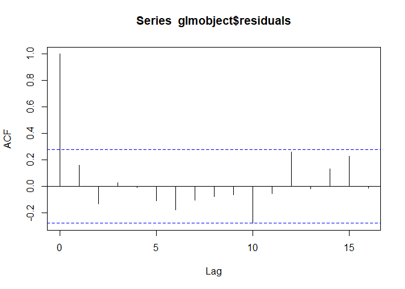

README
================
JonathanB-L
2023-02-07

- <a href="#1-installing-the-package" id="toc-1-installing-the-package">1
  Installing the package</a>
- <a href="#2-package-guide" id="toc-2-package-guide">2 Package Guide</a>
  - <a href="#21-summarise_glm" id="toc-21-summarise_glm">2.1
    summarise_glm</a>
  - <a href="#22-rsl-run-load-save" id="toc-22-rsl-run-load-save">2.2 rsl:
    Run, load, save</a>

Testing introduction text

# 1 Installing the package

To install this package you will need install the `devtools` package if
you don’t already have it, otherwise skip this step:

``` r
install.packages("devtools")
```

Install using `install_github`

``` r
library(devtools)

install_github("JonathanB-L/UsefulR")
```

# 2 Package Guide

This package is a small project where I will add a collection of mostly
unrelated useful functions that I think could help users write faster
simpler R scripts. See examples below for how to use each method.
Remember, you can always check any functions’ description\documentation
by using the `?`, example : `?summarise_glm`.

## 2.1 summarise_glm

Despite the name, this function can be used with the `lm`, `glm`
functions from the `stat` package and with `gam` from the `mgcv`
package. This method will handle printing a summary, residual plots, a
QQ plots, the auto-correlation function plot of the residuals and a plot
the model fit over the raw data. Here is a quick example using
`summarise_glm` on linear model fit to the built-in cars dataset:

``` r
library(datasets) # A default package that comes with R
data(cars) # load the data

# fit the model 
mod <-  lm(formula = dist ~ speed, data = cars)

# evaluate the model with summarise_glm
summarise_glm(mod, main = "Linear regression of car speed against stopping distance")
```

    ## 
    ## Call:
    ## lm(formula = dist ~ speed, data = cars)
    ## 
    ## Residuals:
    ##     Min      1Q  Median      3Q     Max 
    ## -29.069  -9.525  -2.272   9.215  43.201 
    ## 
    ## Coefficients:
    ##             Estimate Std. Error t value Pr(>|t|)    
    ## (Intercept) -17.5791     6.7584  -2.601   0.0123 *  
    ## speed         3.9324     0.4155   9.464 1.49e-12 ***
    ## ---
    ## Signif. codes:  0 '***' 0.001 '**' 0.01 '*' 0.05 '.' 0.1 ' ' 1
    ## 
    ## Residual standard error: 15.38 on 48 degrees of freedom
    ## Multiple R-squared:  0.6511, Adjusted R-squared:  0.6438 
    ## F-statistic: 89.57 on 1 and 48 DF,  p-value: 1.49e-12

<!-- --><!-- --><!-- -->

For glm’s or gam’s which can have multiple variables, you can choose
which of the variables you’d like to plot dependent variable against
using the `xcoord =` argument. You can also use `xlab =` and `ylab =`
argument to change the axis titles but the method will do it’s best to
get the variable names from the data automatically. See `?summarise_glm`
for details.

## 2.2 rsl: Run, load, save

When modeling large datasets with complicated models that take a long
time to compute, it’s generally in your best interest to save the model
somewhere on your device and load it from memory when reopening your
workflow instead of wasting time running the model again. So you might
use code like this to do so:

``` r
# NOT RUN
mod <- some_model_function(data) # some function that could take very long to compute

setwd("C:\Path_to_folder") # choose where to save the model

save(mod, file = "my_model.rda") # save the model in the chosen folder

load("my_model.rda") # load the model
```

But when you reopen your workflow and want to run it you have to make
sure the `mod <- ...` and `save(...` lines are commented out with `#`.
And if you you want to update the model then you have to go remove those
comments first. This problem only compounds itself when you have
multiple objects that need to be saved and loaded in a long script: this
was precisely the problem I ran into and made the `rsl` method as a
solution. Now you can handle all of the above in one instance:

``` r
# NOT RUN

rsl(func = some_model_function(data), # the method to be executed
    obj_name = "mod", # name to assign to the output from above
    run = T, # run the model and save it
    d = "C:\Path_to_folder" # where to save the output 
    #saves the model as : "mod.rda" (specifically as obj_name.rda)
    )
```

If you set `run = F` the method will instead search the folder from
`d = "C:\Path_to_folder"` for “obj_name.rda” and load it into R. So now
instead of commenting and un-commenting multiple lines when you need to
change between evaluating or loading a model, you just need to change
`run = T` to `run = F`. But what if you have multiple models across your
workflow? Scrolling down to change each `run` argument can still be
tedious. That’s where `rsl`’s accompanying method `set_rsl_default`
comes in.

This method comes with three arguments. `d_default` is used to set the
writing directory where all `rsl` functions will save their output.
`run_default` will set the default argument for `run` for all `rsl`
functions to either TRUE or FALSE. The third argument is
`override_default`. If you specify arguments for `run` and `d`, `rsl`
will use those arguments first and ignore the settings from
`set_rsl_default`. But with `override_default = TRUE`, all `rsl`
functions will use `d_default` and `run_default` regardless of what’s
written in them. So combining both methods, we can change the above code
to something like this:

``` r
# NOT RUN

# Set this somewhere at the top of your workflow
set_runfast_default(run_default = TRUE, override_default = TRUE, d_default = "C:\PATH_TO_FOLDER") # evaluate and save, overriding other inputs

# some work

#later in your workflow:
rsl(func = some_model_function(data), # the method to be executed
    obj_name = "mod1", # name to assign to the output 
)

# potentially more models in your workflow:
rsl(func = some_other_model_function(data), # the method to be executed
    obj_name = "mod2", # name to assign to the output 
    run = FALSE # Note: Since override_default = TRUE, this argument will be ignored
)
```

Now you can handle if you want to load all your models from memory or
re-evaluate them (possibly because you want to make some changes to
them, for example) all with a single TRUE or FALSE statement at the top
of your workflow.

Let’s do a practical example you can try to run on your machine using
the same linear model from the `summarise_glm` section:

``` r
library(datasets) # A default package that comes with R
data(cars) # load the data

#set rsl defaults
set_rsl_default(run_default = TRUE, d_default = "C:\PATH_TO_FOLDER") # change this yourself to where you want to save your .rda files
#now you don't need to specify "d =" or "run =" in rsl

# fit the model save it
rsl(func = lm(formula = dist ~ speed, data = cars), # fit a linear model
    obj_name = "mod", # name
    )

# you can check that the lm mod has been created
summary(mod)
```

    ## 
    ## Call:
    ## lm(formula = dist ~ speed, data = cars)
    ## 
    ## Residuals:
    ##     Min      1Q  Median      3Q     Max 
    ## -29.069  -9.525  -2.272   9.215  43.201 
    ## 
    ## Coefficients:
    ##             Estimate Std. Error t value Pr(>|t|)    
    ## (Intercept) -17.5791     6.7584  -2.601   0.0123 *  
    ## speed         3.9324     0.4155   9.464 1.49e-12 ***
    ## ---
    ## Signif. codes:  0 '***' 0.001 '**' 0.01 '*' 0.05 '.' 0.1 ' ' 1
    ## 
    ## Residual standard error: 15.38 on 48 degrees of freedom
    ## Multiple R-squared:  0.6511, Adjusted R-squared:  0.6438 
    ## F-statistic: 89.57 on 1 and 48 DF,  p-value: 1.49e-12

If you open your file explorer you should see “mod.rda” in the folder
you chose. Now try removing mod and the cars data from your workspace,
this could simulate closing your R session and clearing your R
workspace:

``` r
rm(cars, mod) # remove cars and mod from workspace
```

Now lets load mod.rda from your folder. You could do this two ways:

1.  Set `run_default = FALSE` at the top of your workflow and run both
    functions

``` r
#set rsl defaults
set_rsl_default(run_default = FALSE, d_default = "C:\PATH_TO_FOLDER") # change this yourself to where you want to save your .rda files
#now you don't need to specify d in rsl()

# load the model
rsl(func = lm(formula = dist ~ speed, data = cars), # fit a linear model
    obj_name = "mod" # name
    )

# you can check that the lm object mod has been loaded
mod
```

    ## 
    ## Call:
    ## lm(formula = dist ~ speed, data = cars)
    ## 
    ## Coefficients:
    ## (Intercept)        speed  
    ##     -17.579        3.932

OR

2.  simply set `run = TRUE` in `rsl` and run the function alone:

``` r
# load the model
rsl(func = lm(formula = dist ~ speed, data = cars), # fit a linear model
    obj_name = "mod", # name
    run = T
    )

# you can check that the lm object mod has been loaded
mod
```

    ## 
    ## Call:
    ## lm(formula = dist ~ speed, data = cars)
    ## 
    ## Coefficients:
    ## (Intercept)        speed  
    ##     -17.579        3.932

Note that you didn’t need to load the cars data anymore since you’re
just loading the model from your folder, not evaluating a new linear
model.
